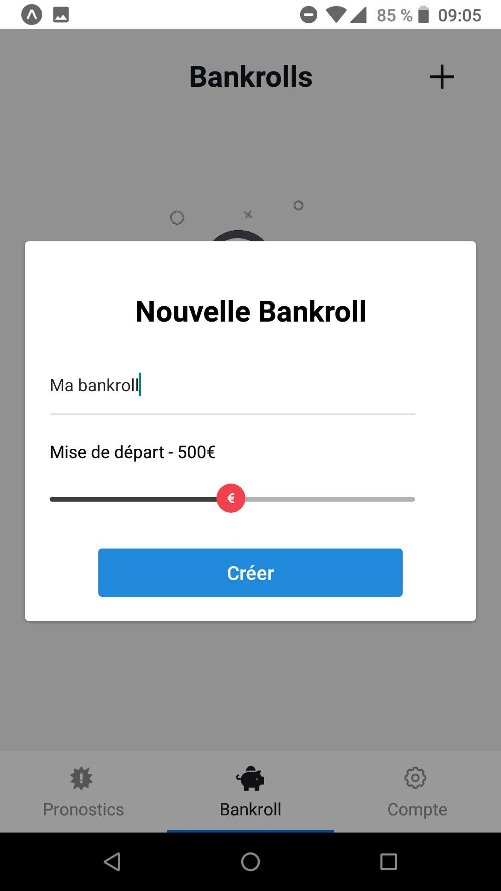

# Remontada App

[Lien vers ExpoStore pour télécharger l'application](https://expo.io/@qoux/projects/remontada-app)

<h3>MVC d'application mobile de gestion de Bankroll et d'amélioration des gains à long terme.</h3>

<h2>Stack</h2>

<h3>Frontend</h3>

- React Native
- Expo-Cli

<h3>Backend</h3>

[Backend Repo](https://github.com/qroux/strapi-api)

- Strapi
- Node.js
- MongoDB

|                                                                      |                                                                      |                                                                      |                                                                 |                                                                 |                                                                  |                                                                 |
| :------------------------------------------------------------------: | :------------------------------------------------------------------: | :------------------------------------------------------------------: | :-------------------------------------------------------------: | :-------------------------------------------------------------: | :--------------------------------------------------------------: | :-------------------------------------------------------------: |
|  |  |  |  |  |   |  |
|       |       |       |  |  |  |
